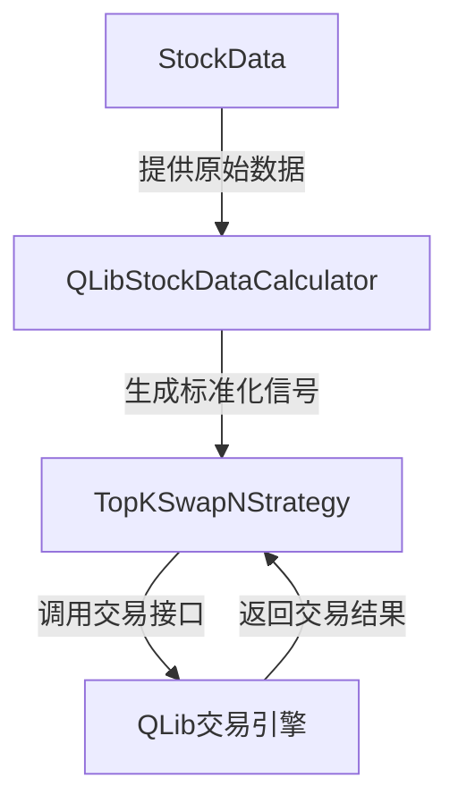
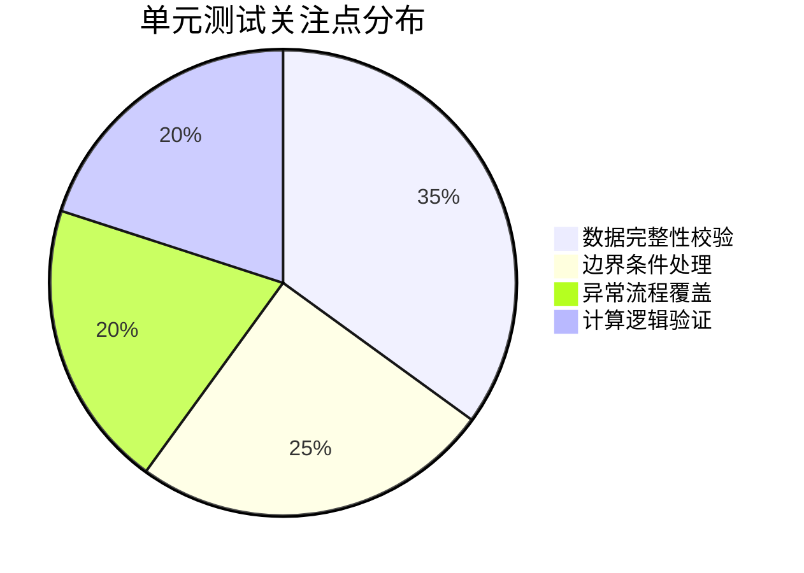
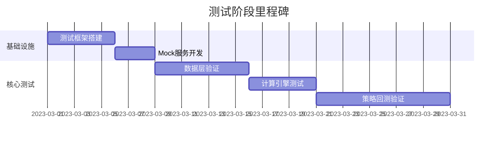

# AlphaGen QLib 测试套件设计方案

## 模块依赖关系


## 测试策略
### 单元测试重点


### 集成测试方案
| 测试场景 | 验证目标 | 数据规模 |
|---------|---------|---------|
| 完整交易流程 | 端到端策略执行 | 100支股票×30天 |
| 极端市场数据 | 系统稳定性 | 500支股票×100天 |
| 网络异常恢复 | 容错机制 | 人工模拟断线 |

## Mock服务设计
```python
class MockQLibLoader:
    def __init__(self, feature_matrix: torch.Tensor):
        self._data = {
            '$close': feature_matrix,
            '$volume': torch.randint(1e4, 1e5, feature_matrix.shape)
        }
    
    def load(self, instruments, start, end):
        return pd.DataFrame({
            (instrument, field): self._data[field][:,i] 
            for i, instrument in enumerate(instruments)
            for field in ['$close', '$volume']
        })
```

## 测试实施计划


## 质量保障指标
1. 单元测试覆盖率 ≥85%
2. 集成测试用例通过率 100%
3. 关键路径性能指标：
   - 数据加载 <500ms/万条
   - 策略计算 <100ms/交易日